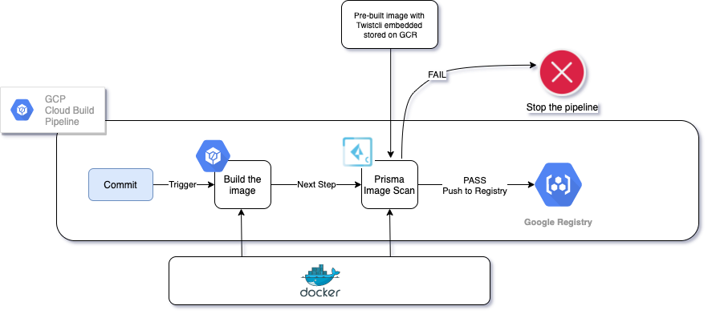

# PC_GCP_CloudBuild_ImageScan

### Components used 

Google Cloud Registry - to store images - used for convenience

Google Secrets manager - used to store credentials (Essential because the image has gcloud sdk to retrieve secrets  and pass to twistcli)

### Steps

* Build the Docker Image with Twistcli from Google Cloud Shell ( files inside the /gcp_twistcli_image directory )

      gcloud builds submit --tag 'gcr.io/${PROJECT_ID}/prisma-twistcli'

   
* Enable Secrets Manger API from Google Cloud Shell

      gcloud services enable secretmanager.googleapis.com

* Create the secret and store Prisma Console Password - You can use the Variable name TWISTLOCK_PASS 
   
* Allow Google Cloud Build to Access Secret Manager

* Allow the PROJECT_NUMBER@cloudbuild.gserviceaccount.com service account with the role "Secret Manager Secret Accessor" to Access the TWISTLOCK_PASS Secret

* Configure the Cloudbuild.yaml with your Prisma Cloud URL, User and the Secret Name 
